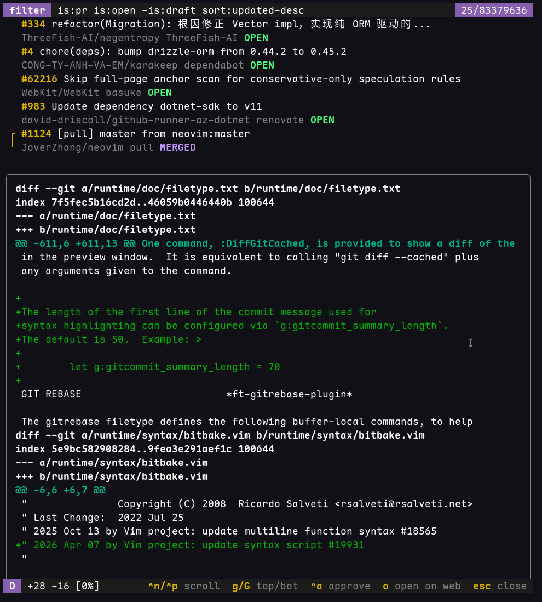

# gh-purview

A terminal UI for browsing and approving GitHub pull requests.

This isn't designed to be a complete review tool, I created it specifically to address handling dozens of tiny dependency updates across the 240+ repositories in our organization without wanting to open each of them up in GitHub's declining web interface.



## Installation

### As a GitHub CLI extension

```bash
gh extension install BaconIsAVeg/gh-purview
```

Then run with:

```bash
gh purview
```

To update to the latest release:

```bash
gh extension upgrade BaconIsAVeg/gh-purview
```

### Standalone

Download the binary for your platform from the [releases page](https://github.com/BaconIsAVeg/gh-purview/releases) and add it to your PATH.

You'll need to set a GitHub token:

```bash
export GH_TOKEN=$(gh auth token)
# or
export GITHUB_TOKEN=your_token_here
```

Then run:

```bash
gh-purview
```

## Environment Variables

- `GH_TOKEN` or `GITHUB_TOKEN` - GitHub authentication token
- `GH_MDCA` - When set, transforms GitHub URLs to support Microsoft Defender for Cloud Applications (e.g., `github.com` becomes `github.com.mcas.ms`)

## Features

- **Browse PRs** - View all pull requests where you're requested as a reviewer
- **Filter PRs** - Use GitHub search syntax to filter pull requests
- **Preview diffs** - View the diff for any PR directly in the terminal
- **Approve PRs** - Approve pull requests with a single keypress
- **Open on GitHub** - Quickly open any PR in your browser
- **Theme detection** - Automatically adapts colors to light or dark terminal backgrounds

## Filter Syntax

The filter uses standard GitHub search syntax. Some useful examples:

- `is:pr is:open review-requested:@me` - PRs requesting your review
- `is:pr is:open author:@me` - Your open PRs
- `is:pr is:open org:myorg` - Open PRs in an organization
- `label:bug` - PRs with a specific label

See [GitHub's search documentation](https://docs.github.com/en/search-github/searching-on-github/searching-issues-and-pull-requests) for more options.

## Saved Filters

Frequently used queries can be saved as named filters in a config file at `$XDG_CONFIG_HOME/gh-purview/config.yml` (typically `~/.config/gh-purview/config.yml`). On first run, if no config file exists, gh-purview creates this directory and file automatically with the built-in default filter so you can simply edit it in place. See [`config.sample.yml`](config.sample.yml) for a ready-to-edit template with additional example filters.

```yaml
default:
  query: "is:pr is:open -is:draft review-requested:@me sort:updated-desc"

filters:
  mine:
    query: "is:pr is:open author:@me sort:updated-desc"
```

- **`--filter <name>`** - start with a saved filter, e.g. `gh-purview --filter mine`. An unknown name exits with an error.
- **`--filter default`** - explicitly use the `default:` section.
- With no flag, the app resumes the last query you applied via the in-app `f` edit; otherwise the `default:` section (or the built-in default) is used.

The last query applied through the in-app filter editor is persisted to `$XDG_CACHE_HOME/gh-purview/last.yml` so the next launch picks up where you left off. This is app-managed state and may be deleted safely.
